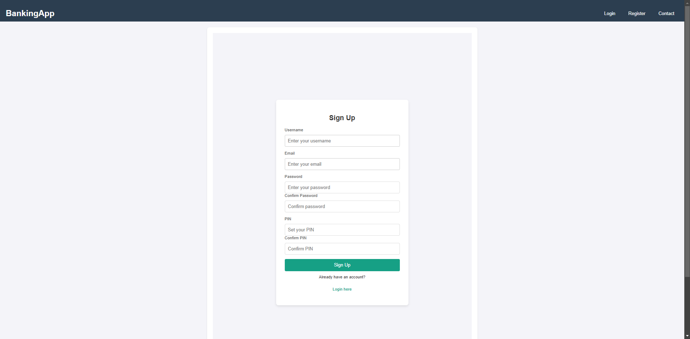

# ATM Banking System

Greetings! This repository is intended for the final project of the ATM Banking System group of CSIT327 section G5 of the Cebu Institute of Technology-University to be submitted to Mr. Joemari Amparo.

The members/contributors for this project are so named:


**Nap Adriel B. Derecho**

**Neil Bas**
---

## Table of Contents

- [Features](#features)
- [Technologies](#technologies)
- [Installation](#installation)
- [Usage](#usage)
- [Folder Structure](#folder-structure)
- [Contributing](#contributing)
- [License](#license)
- [Acknoledgements](#Acknowledgements)

---https://github.com/adxcz/ATM_banking

## Features

- **User Authentication**: Sign up and log in securely.
- **Account Management**: View account balances, transaction history, and manage banking services.
- **Responsive Design**: Optimized for desktop and mobile devices.
- **Customer Support**: Easily reach out for assistance via the contact page.

---

## Technologies

- **Backend**: Django (Python)
- **Frontend**: HTML, CSS
- **Database**: SQLite3
- **Version Control**: Git, GitHub
- **Deployment**: Localhost for development, can be deployed on any server.

---

## Installation

Follow the steps below to set up the project locally:

1. **Clone the repository**:
 ```
git clone https://github.com/adxcz/ATM_banking.git
   cd atm_banking
```
   
Set up a virtual environment (optional but recommended):
```
python -m venv venv
source venv/bin/activate  # On Windows: venv\Scripts\activate
```
Install dependencies:
```
pip install -r requirements.txt
```

Run database migrations:
```
python manage.py makemigrations
python manage.py migrate
```

Start the development server:
```
python manage.py runserver
```

Access the app:
```
Open http://127.0.0.1:8000/
```

 in your browser to start using the application.
Usage
New Users: Sign up and log in to start managing your account.
Existing Users: Log in to access your account details and manage transactions.
Admin Panel: Access the Django admin panel via /admin to manage users and application data.
Folder Structure
```
├── atm_banking         # Main Django app
├── static_collected    # Collected static files for deployment
├── web_project         # Django project settings and configurations
├── db.sqlite3          # SQLite database file
├── manage.py           # Django management commands script
├── .gitignore          # Git ignore file for version control
└── requirements.txt    # List of dependencies for the project
```
Old ERD

Updated ERD

Relationships
User and BankAccount: One-to-Many (A user can have multiple bank accounts).
BankAccount and Transaction: One-to-Many (An account can have multiple transactions).
User and ContactSupport: One-to-Many (A user can submit multiple inquiries).


UI/UX
Home

Login

Register

Dashboard

Deposit

Withdraw

Contact

Send Money

Change Pin


Gantt Chart:


Contributing
We welcome contributions! If you want to improve the project, follow these steps:

Fork the repository to your own GitHub account.
Clone your fork to your local machine:
```
git clone https://github.com/your-username/ATM_banking.git
cd ATM_banking
```
Create a new branch for your feature:
```
git checkout -b feature-name
```
Make your changes and commit them:
```
git commit -m "Add feature-name"
```

Push your changes to your forked repository:
```
git push origin feature-name
```
Open a pull request to the main repository to propose your changes.


## Acknowledgements

Django Framework: Django

SQLite Database: SQLite

GitHub: GitHub
